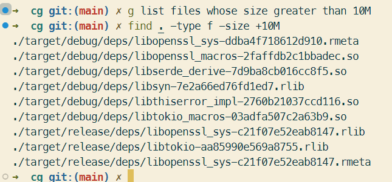
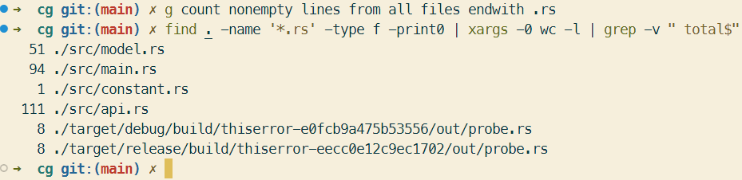

# ChatGPT Command Generation

一个利用 ChatGPT 生成命令行的小工具

A small tool that uses ChatGPT to generate a command line

## Enviroment

1. `OPENAI_API_KEY` ：OpenAI API KEY
2. `HTTPS_PROXY`: A ChatGPT available proxy (optional)

## Install

```bash
cargo build --release --locked
```

或

```bash
cargo install --locked --path . 
```

## zsh Plugin

1. put `/plugins/` under `$ZSH_CUSTOM`
(by default: `~/.oh-my-zsh/custom/plugins/cg/cg.plugin.zsh`)，
2. Add the plugin to the list of plugins for Oh My Zsh to load (inside  `.zshrc`)

```zsh
plugins=( 
    # other plugins...
    cg
)
```

## Screenshots




