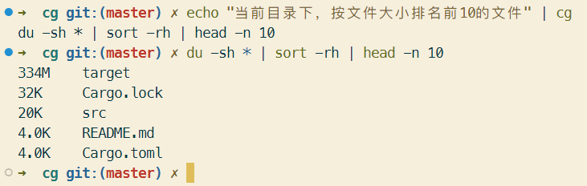
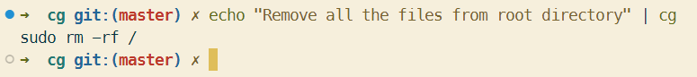

# ChatGPT Command Generation

一个利用 ChatGPT 生成命令行的小工具

## 环境准备

1. `OPENAI_API_KEY` ：OpenAI 的 API KEY
2. `HTTPS_PROXY`: 一个 ChatGPT 可用的代理工具

## 编译安装

```bash
cargo build --release --locked
```

或

```bash
cargo install --locked --path . 
```

## 演示



